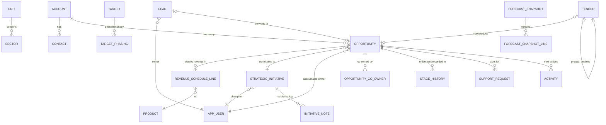

# 04 — Data Model

The runnable source of truth is [`schema.sql`](schema.sql) (PostgreSQL). This document explains
it. The Spec's fourteen entities (§4 + Tender §15 + Stage History §16) expand to the tables
below once join tables, history, snapshots and audit are made concrete.

## 1. Entity-relationship overview

## 2. Table inventory

| Table | Spec origin | Notes |
|---|---|---|
| `unit`, `sector` | §15 correction | Fixed hierarchy: unit contains sectors; `sector` **is** the workbook's `Dept`. Department retired (Decision D-05). |
| `product`, `pipeline_stage`, `ref_list`/`ref_value`, `system_setting` | §4 Reference List, §6, H1 | Stages carry sort order, default probability and exit criterion. Generic `ref_value` covers lead source, loss reason, disqualification reason, hold reason, initiative status, cost category, tender outcome reason. Values deactivate, never delete. |
| `app_user` | §4 User & Team, §16 | Adds capacity reference, pipeline/initiative split, availability % (§16 additions). |
| `account`, `contact` | §4 | Unique on normalised name (duplicate guard, FR-ACC-02). `operations_ref` carries the handover reference (§1). |
| `lead`, `lead_product_interest` | §5.1 | CHECK constraints enforce BR-LEAD-01/02 at the database, not just the app. |
| `opportunity`, `opportunity_co_owner` | §5.2, §16 | Single accountable owner + co-owner join table. Stage/outcome separated; CHECKs enforce loss/hold reasons. `stage_entry_backfilled` flags migration approximations (§16). |
| `support_request` | §15 correction | Typed intervention (management / MRS), who asked, when, resolution — not one flag. |
| `owner_reassignment` | J2 / D-13 | Reassignment is an audited event with a reason. |
| `stage_history` | §16, "the fourteenth entity" | One row per stage change, written automatically by StageService. The only thing that cannot be added retrospectively. |
| `revenue_schedule_line` | §5.3 | The money. Month pinned to day 1 by CHECK; amount must be numeric > 0; **weighted amount is not a column** — see `v_schedule_line_weighted`. |
| `activity` | §4 Activity, §16 | Next actions are activities with due + completion dates; overdue is derivable. |
| `strategic_initiative`, `initiative_co_champion`, `initiative_note` | §5.4, §16 | Delivered / expected / gap / linked-opportunities are **views**, never columns. Notes are append-only with author + timestamp. |
| `tender` | §15 | Own lifecycle; `value_basis` enum makes mixed-basis summing impossible (BR-TEN-01); self-FK links tender→prequalification. |
| `target`, `target_phasing` | §8.1, §15 | Level-dimensioned targets with monthly phasing and versioning (revisions supersede, never overwrite). |
| `budget_line` | §8.2 | Cost budget vs actual, linkable to opportunity or initiative. Build order per D3. |
| `forecast_snapshot`, `forecast_snapshot_line` | §7 | Immutable, denormalised month-end copies. App DB role has no UPDATE/DELETE grant on them. |
| `audit_log` | §3, §11 | Field-level, append-only, written in-transaction. |
| `revenue_actual` | §15 / I1–I3 | Phase-2 landing zone for YTD actuals and proformas by revenue line. Exists so Phase 2 needs no schema change; unused in Phase-1 UI. |

## 3. How each §3 finding is made impossible

| Spec §3 finding | Schema guard |
|---|---|
| No unique identifiers | Identity PKs everywhere; name is display-only; unique normalised account name catches duplicates |
| Stage and outcome in one field | `stage_id` FK + `outcome` enum, separate columns |
| No clean dates | `date` / month-pinned `date` types; `close_confidence` enum is where "TBA" lives |
| Uncontrolled picklists | Every categorical field is an FK to `ref_value` / first-class list tables |
| Multiple owners in one cell | `owner_id` (one) + `opportunity_co_owner` (many) |
| Aggregates inside the data | No total/weighted/gap columns exist in base tables; views only |
| Fragile cross-sheet links | `initiative_id` FK; cannot be silently repointed by sorting anything |
| Three-way duplication | One row per fact; the reconciliation sheet has no table to live in |
| Errors and residue | `CHECK (expected_amount > 0)` and numeric types; a text space cannot be stored |
| Links already broken | FKs with referential integrity; deactivation instead of deletion |
| No version control | One database; optimistic locking (NFR-DATA-03); `audit_log` is the history |

## 4. Deliberate modelling decisions (full rationale in doc 12)

- **D-05 Department retired.** Unit⊃sector is the single hierarchy; the migration maps
  workbook `Dept` → sector. If the BD team defines a distinct meaning for department, it
  returns as one nullable FK — no restructuring.
- **D-09 `actual_amount` now.** Forecast accuracy (§15 measure table) needs it, and adding it
  later restates history — the Spec's own currency-field argument.
- **D-10 Opportunity→initiative is one-to-many** (nullable FK, not a join table), pending E1.
  If E1 answers many-to-many, the FK migrates to a join table with a contribution split —
  known, contained change.
- **Weighted amount is never stored** on live tables (always derived) but **is stored** on
  snapshot lines — a snapshot is a record of what the number *was*, and must not drift when a
  probability later changes.
- **Snapshot lines are denormalised** (codes and names copied in) for the same reason:
  renaming a unit next year must not rewrite history.
- **C1 contingency** (commission vs premium): if amounts are premium, `revenue_schedule_line`
  gains `premium_amount` + `commission_rate` and `expected_amount` becomes derived. The change
  is confined to one table and doc 08's formulas; nothing else moves.
- **Enums vs ref tables:** structural vocabularies whose values carry code-level meaning
  (`outcome`, `value_basis`, `tender_status`, `lead_status`) are DB enums; everything the
  admin may edit is a row (FR-ADM-01).

## 5. Phase-2 readiness checklist

Already in the day-one schema so I1 = "produce the pack" does not force a redesign:
`revenue_type` on schedule lines (new business vs renewal/cross-sell), `value_basis` on
tenders, `actual_amount` on lines, `target_phasing` (monthly budget phasing),
`revenue_actual` landing table (actuals + proformas by revenue line and sector), and
`currency` on every money field.
